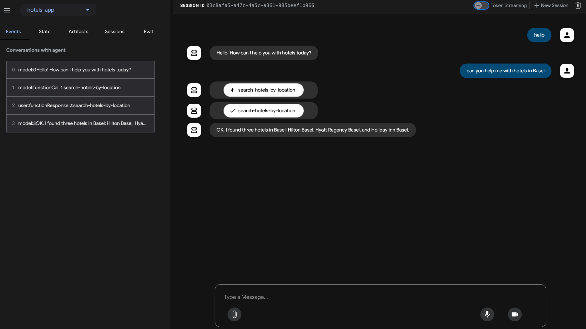

# 🏨 Hotels Chatbot

## 📘 Overview
This is a RAG-based chatbot that helps users find hotels by location.  
It uses Gemini for natural language understanding, PostgreSQL for storing hotel data, and an MCP server to handle function calls between the chatbot and the database.

---

## ⚙️ What It Does
- Lets users chat naturally (e.g., “Can you help me with hotels in Basel?”)  
- Searches the database for hotels in that city  
- Returns hotel names and details using a clean chatbot interface  
- Uses RAG (Retrieval-Augmented Generation) to fetch relevant results  

---

## 🧠 How It Works

User → Gemini Model → MCP Server → PostgreSQL → Response

1. User sends a message  
2. Gemini understands the query  
3. MCP server triggers the function `search-hotels-by-location`  
4. PostgreSQL returns matching hotel data  
5. Chatbot replies with the results  

---

## 🧰 Tech Stack
- Gemini API – For conversation and understanding  
- MCP Server – Handles communication between model and database  
- PostgreSQL – Stores hotel data  
- Python – Main programming language  

---

## 🧩 Example Conversation
**User:**  
Can you help me with hotels in Basel?  

**Bot:**  
Sure! I found three hotels in Basel:  
- Hilton Basel  
- Hyatt Regency Basel  
- Holiday Inn Basel  

---

